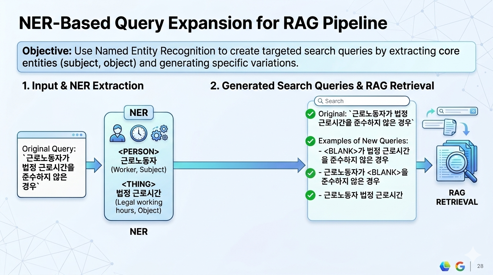

# Global / Local-Aware Semantic Search Experiments

This repo is about hacking on **semantic search** over embeddings so that we can better separate and retrieve **global context** vs **local details** using a single vector DB.

Most current systems convert text/images/audio into dense vectors and do similarity search on top of them. This works well for many use cases, but breaks down when documents are hierarchical and we care about different granularity levels (intro vs background vs fine-grained details).

---

## Why this project?

Typical vector-based semantic search has a few pain points in real-world RAG setups:

- It treats all chunks more or less at the **same level**.  
  - Example: a long document has an introduction, background, and detailed sections. The user asks a question that conceptually needs intro/background context, but the query embedding is closer to some detailed sentences, so only those get retrieved.
- This becomes especially annoying when trying to build **graph-based RAG** or anything that needs both:
  - high-level / global nodes (document-level, section-level, topic-level)
  - low-level / local nodes (paragraphs, sentences, facts)
- Existing workarounds:
  - Use a **graph DB** + vector DB together, or  
  - Do heavy **LLM-based preprocessing/summarization** to attach global context to each chunk.
- Problems with those workarounds:
  - You now maintain **multiple storage/index structures** (e.g. graph DB + vector DB), which complicates infra and consistency.  
  - LLM-in-the-loop preprocessing is **expensive and slow** for large corpora, and often overkill for experimentation.

This project is an attempt to see **how far we can push “plain” vector DB setups** by being smarter about query / embedding handling, without introducing another DB or heavy LLM preprocessing.

---

## Core Idea

> Can we get both “global” and “local” retrieval behavior out of a single embedding store, purely by manipulating **queries** and **vectors**?

The main directions we’re experimenting with:

1. **Query decomposition without LLMs**
2. **Embedding-dimension masking for global/local emphasis**
3. **NER-based query broadening/narrowing**

---

## Methods

### 1. NER-based keyword manipulation

To avoid full-blown LLM query rewriting, we can lean on lightweight NER like **GLiNER** to detect entities/keywords in the query.

Example (Korean labor-law query):

- Original:  
  `근로노동자가 법정 근로시간을 준수하지 않은 경우`
- Possible variants:
  - `<BLANK>가 법정 근로시간을 준수하지 않은 경우`
  - `근로노동자가 <BLANK>을 준수하지 않은 경우`
  - `근로노동자 법정 근로시간`

Possible use cases:

- Remove/skew specific entities to **broaden** the query and favor more general background sections.
- Keep entity-focused variants for **local** retrieval (specific case law, specific clause, etc.).
- Combine NER-driven variants with embedding masking for more controlled search behavior.

---

### 2. Embedding-level masking / slicing

Some embedding models explicitly or implicitly structure information across vector dimensions (e.g., certain parts capturing more global semantics vs more fine-grained ones, depending on model design / training signal).

If we can identify or at least approximate such structure, we can try:

- At query time, **zero-out** or down-weight certain index ranges:
  - “global-view query”: keep dimensions believed to encode coarse/global info, zero-out the rest.
  - “local-view query”: keep dimensions believed to encode fine/local info, or emphasize them.
- Run multiple vector searches:
  - global-query → retrieve context / overview chunks
  - local-query → retrieve detailed evidence chunks

This keeps:
- same documents
- same chunking
- same vector DB

but allows **multi-layer retrieval** by only changing how we build/query vectors.

---

### 3. Decompose full query hidden states before using
Standard dense retrieval encodes a query into a single vector, which struggles with complex, multi-faceted queries where a single vector cannot simultaneously represent all the semantic aspects needed to retrieve relevant documents. Instead of generating textual sub-queries with an LLM or storing per-token vectors like ColBERT, we propose decomposing the query embedding directly into multiple orthogonal aspect vectors using a Hadamard rotation — with no retraining and no additional generation step.

Given the token-level hidden states from the final layer of the embedding model, we apply an attention-weighted mean pool to obtain a single query representation, then rotate it into the Hadamard space where correlated dimensions are disentangled. We split the rotated vector into nn
n equal-sized blocks, each corresponding to an orthogonal semantic axis, and project each block back into the original embedding space to produce nn
n full-dimensional aspect vectors. Each aspect vector is then used independently for retrieval against the document index, and results are merged via Reciprocal Rank Fusion (RRF). This approach produces a fixed number of diverse, semantically distinct query vectors that collectively cover more retrieval intents than a single pooled embedding.

---

## Evaluation

Off-the-shelf IR benchmarks like **BEIR** are not a great fit here, because they mostly assume:
- “Did you retrieve the correct document/passage?” as a single target.

Our focus is more like:
- “Did we retrieve the *right mix* of global context and local details that leads to a better RAG answer?”

So instead of classic IR-only evaluation, we lean on **RAG pipeline–level evaluation**:

- Use **RAGAS** / RAG evaluation frameworks to score:
  - context relevance / recall
  - answer relevance
  - faithfulness, etc.
- Possibly use **eRAG-style** end-to-end evaluation where the pipeline is:
  - query → retrieval (with our tricks) → LLM answer → automatic scoring.
- Dataset:
  - Start with **Wikitext-based** or Wikipedia-like corpora where documents are naturally hierarchical (lead section, background, detail).
  - Create question sets that explicitly require:
    - only global info
    - only local info
    - a mix of both

The expectation is not “higher recall@k on BEIR”, but **better RAG quality metrics** when the system must combine global and local evidence.

---

## Status

- This is currently an **experimental playground**, not a production-ready library.
- Expect:
  - messy notebooks
  - small scripts
  - many failed ideas committed with TODOs

If you’re interested in collaborating or have ideas on embedding-structure-aware retrieval or non-LLM query decomposition, PRs and issues are welcome.

---

## Reference Papers
